## **Big Data Architecture on Azure (Multiple Datasets & Security)**

```mermaid
graph LR
    subgraph Data Sources [Data Ingestion]
        A[On-Premise Databases] --> B[Azure Data Factory];
        D[Streaming Logs] --> B;
        E[Third-Party APIs] --> B;
    end

    subgraph Data Storage & Processing [Secure Zones]
        B --> F{Data Lake Azure Data Lake Storage Gen2};

        subgraph Zone 1: Raw/Bronze
            F --> G[Raw Data Bronze];
        end

        subgraph Zone 2: Cleansed/Silver
            G --> H[Cleansed Data Silver];
        end

        subgraph Zone 3: Curated/Gold
            H --> I[Curated Data Gold];
        end

        F --> J[Azure Synapse Analytics SQL Pools/Spark Pools];
        J --> K[Data Warehouse];
        J --> L[Data Lake Analytics Spark];

    end

    subgraph Data Consumption & Analytics [Secure Access]
        K --> M[Power BI Reporting/Dashboards];
        L --> N[Azure Machine Learning ML Models];
        K --> O[Custom Applications APIs/Web Apps];
    end

    subgraph Security & Governance [Centralized]
        P[Microsoft EntraID] --> B;
        P --> F;
        P --> J;
        P --> M;
        P --> N;
        P --> O;

        Q[Azure Purview Data Catalog & Governance] --> F;
        Q --> K;

        R[Azure Key Vault Secrets Management] --> B;
        R --> J;
    end

    style A fill:#400,stroke:#333,stroke-width:2px
    style D fill:#400,stroke:#333,stroke-width:2px
    style E fill:#400,stroke:#333,stroke-width:2px
    style F fill:#040,stroke:#333,stroke-width:2px
    style G fill:#400,stroke:#333,stroke-width:2px
    style H fill:#400,stroke:#333,stroke-width:2px
    style I fill:#400,stroke:#333,stroke-width:2px
    style J fill:#004,stroke:#333,stroke-width:2px
    style K fill:#004,stroke:#333,stroke-width:2px
    style L fill:#004,stroke:#333,stroke-width:2px
    style M fill:#222,stroke:#333,stroke-width:2px
    style N fill:#222,stroke:#333,stroke-width:2px
    style O fill:#222,stroke:#333,stroke-width:2px
    style P fill:#440,stroke:#333,stroke-width:2px
    style Q fill:#440,stroke:#333,stroke-width:2px
    style R fill:#440,stroke:#333,stroke-width:2px

```

## **Explanation of Components & Security**

1.  **Data Sources:**
    * Represent various origins of data (databases, streaming data, transactions, third-party APIs).

2.  **Azure Data Factory (ADF):**
    * The primary ETL/ELT service.  Responsible for ingesting data from various sources, transforming it (if needed), and loading it into the Data Lake.
    * **Security:**  Uses Microsoft EntraID for authentication and authorization. Data encryption at rest and in transit is enabled through ADF configuration.

3.  **Azure Data Lake Storage Gen2 (ADLS Gen2):**
    * A highly scalable and secure data lake built on Azure Blob Storage.  It provides a hierarchical namespace for organizing data, making it ideal for storing raw and processed data.
    * **Security:**
      * **Hierarchical Namespace:**  Allows for logical organization of data into folders and subfolders, enabling fine-grained access control.
        * **RBAC (Role-Based Access Control):**  Control who can access specific folders and files within the data lake.
        * **ACLs (Access Control Lists):**  Provide more granular permissions at the file level.
        * **Encryption at Rest:** Data is encrypted by default using Azure-managed keys or customer-managed keys (CMK) for enhanced security.
        * **Data Masking/Tokenization:**  Implement data masking or tokenization techniques to protect sensitive information.

4.  **Data Zones (Bronze, Silver, Gold):**
    * A common pattern for organizing data within the Data Lake.
        * **Bronze (Raw):**  Data in its original format, as ingested from the source.
        * **Silver (Cleansed):**  Data that has been cleaned, validated, and standardized.
        * **Gold (Curated):**  Data that has been transformed into a business-ready format, often aggregated and enriched.
    *   **Security:**  Apply different access control policies to each zone based on the sensitivity of the data.

5.  **Azure Synapse Analytics:**
    * A unified analytics service that combines data warehousing, big data analytics, and data integration.
    * **SQL Pools:**  For structured data warehousing workloads.
    * **Spark Pools:** For big data processing and machine learning.
    * **Security:**  Uses EntraID for authentication, supports encryption at rest and in transit, and provides fine-grained access control to tables and views.

6.  **Data Lake Analytics (DLA):**
    * A serverless big data analytics service that allows you to run unstructured SQL queries against data stored in the Data Lake.
    * **Security:**  Uses EntraID for authentication and supports encryption at rest and in transit.

7.  **Power BI:**
    * A business intelligence tool for creating interactive dashboards and reports.
    * **Security:**  Uses EntraID for authentication, supports row-level security (RLS) to restrict data access based on user roles.

8.  **Azure Machine Learning:**
    * A cloud-based machine learning service for building, training, and deploying ML models.
    * **Security:**  Uses EntraID for authentication, supports encryption at rest and in transit.

9. **Custom Applications:**
    * APIs or web applications that consume data from the data lake.

10. **Microsoft EntraID:**
    * The central identity and access management service for Azure.  Used to authenticate users and applications.

11. **Azure Purview:**
    * A unified data governance service that helps you discover, understand, and govern your data assets.  Provides a data catalog and supports data lineage tracking.

12. **Azure Key Vault:**
    * A secure key management service that allows you to store and manage secrets, keys, and certificates.

## **Personas and Access Control**

Here's a breakdown of common personas and the access control policies you might apply:

* **Data Engineer:** Full access to all zones (Bronze, Silver, Gold) for data ingestion, transformation, and maintenance.
* **Data Scientist:** Access to Silver and Gold zones for model training and experimentation.  Limited access to Bronze zone (raw data) unless specifically required.
* **Business Analyst:** Access only to Gold zone (curated data) for reporting and analysis.
* **Executive:** Read-only access to specific dashboards and reports in Power BI, derived from the Gold zone.
* **Compliance Officer:** Access to Azure Purview for data catalog and governance activities, with limited access to the underlying data.

**Access Control Implementation:**

* **RBAC (Role-Based Access Control):**  Assign users to roles with specific permissions within Azure.
* **ACLs (Access Control Lists):**  Use ACLs to control access at the file and folder level within ADLS Gen2.
* **Row-Level Security (RLS) in Power BI:** Restrict data access based on user roles.
* **Dynamic Data Masking in Synapse Analytics:**  Mask sensitive data based on user roles.

## **Considerations**

* **Data Encryption:** Implement encryption at rest and in transit for all data.
* **Network Security:** Use Azure Virtual Network (VNet) and network security groups to isolate your data lake environment.
* **Data Loss Prevention (DLP):**  Implement DLP policies to prevent sensitive data from leaving your environment.
* **Auditing:** Enable auditing to track user activity and identify potential security breaches.
* **Regular Security Assessments:** Conduct regular security assessments to identify vulnerabilities and ensure that your environment is secure.
* **Data Classification:** Classify data based on sensitivity to apply appropriate security controls.

This comprehensive architecture provides a secure and scalable foundation for building big data analytics solutions on Azure, while adhering to best practices for data governance and access control. Remember to tailor the specific security policies and access controls to your organization's unique requirements and regulatory compliance obligations.
